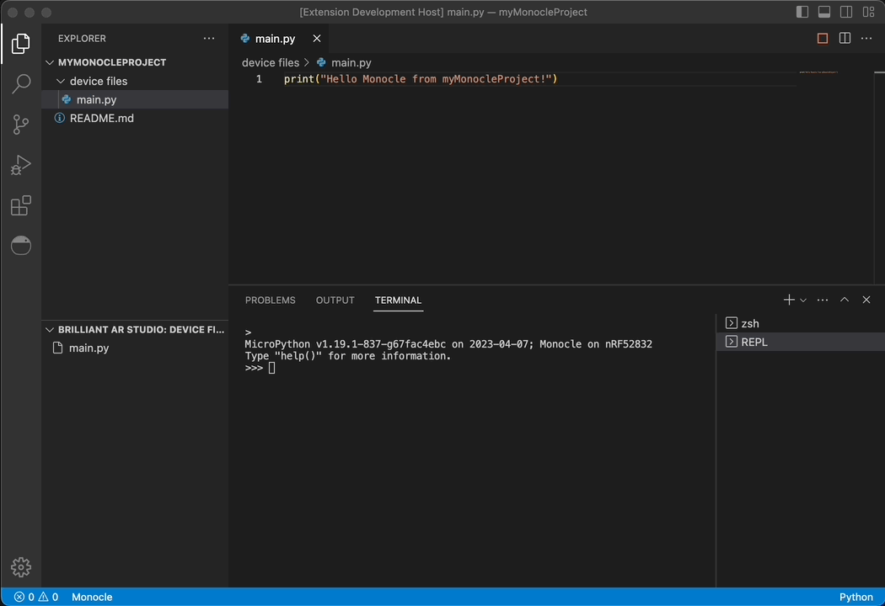
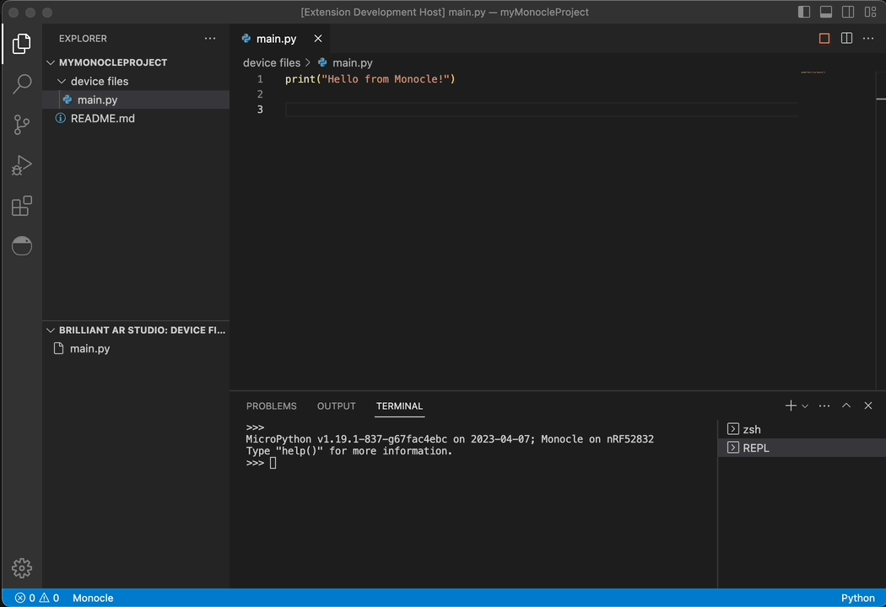
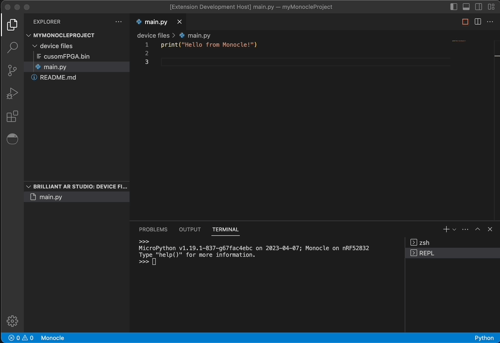

# Brilliant AR Studio

Build and test your Monocle AR apps with ease using MicroPython! 🐍

Check out the full documentation the [docs pages 📚](https://docs.brilliant.xyz), or [contribute 🧑‍💻](https://github.com/brilliantlabsAR/ar-studio-for-vscode) to make this extension even better!

## Features

Loading and saving Python files to your device:

Access the on-device REPL:

Easily browse the various MicroPython modules:

Update your FPGA binaries:

Browse community projects, or publish your own:

### UI instructions

1. Make sure a project is initialized (you can see 'device files' in File Explorer)
   if not setup, do with command `Brilliant AR Studio: Initialize new project folder`
   choose project name and directory and you are good to go.

2. connect monocle from one of the ways

   1. command `Brilliant AR Studio: Connect`
   2. status bar button `Monocle`
   3. file explorer -> Brilliant AR Studio: device files -> connect
   4. (optional) If multiple device present select your device from the dropdown that appears after scan. more value of RSSI with negative sign means device is farther and vice versa

3. after connect you can see REPL and all files listed in `file explorer` -> `Brilliant AR Studio: device files`

4. Now open main.py and edit it.
   you can create any file transferred to device.
   you can also upload files/dir from `device files` dir by
   right click and `Brilliant AR Studio: Upload File To Device` then type path of file at which you want to upload.
   all uploaded files will be tracked with `.brilliant/device-files.json` with relative source and destination.

5. Auto run: it means as soon as you save all files will be transferred and main.py will run. default is always on you turn off by
   button at right corner of editor or command `Brilliant AR Studio: Stop auto run`.
   to start again click on play button at right corner of editor or `Brilliant AR Studio: start auto run`
   (this feture discontinued from v1.15)

6. Run in Device: with this all file will be transferred and excuted at REPL run time
   quite useful to test files without uploading.

   use with button at at right corner of editor or `Brilliant AR Studio: Run in Device`

7. Build: when you are done with editing you can build with `ctrl+shift+b`. It will transfer all earlier files that are uploaded
   and apply soft reset that will execute main.py.

8. ONE output channel and TWO Terminal

   1. (OUTPUT CHANNEL) RAW-REPL: for REPL internal communication (allows to debug issues)
   2. (TERMNAL) REPL: for Interactive python terminal access of Device
   3. (TERMNAL) RAW-DATA: for RAW data communication over data service ( such as you can send microphone bytes to this service)

9. Send Raw Data: data can be directly send at data service to monocle. This data can be received inside monocle by `bluetooth.receive_callback()`. To use the play button at title bar of `file explorer` -> `Brilliant AR Studio: device files` or command `Brilliant AR Studio: Send Raw Data`

10. Context Menu: on right clicking on device files in `file explorer` -> `Brilliant AR Studio: device files` you can perform:
11. Download of files from Device
12. Rename of files
13. Delete from device

# Create and Edit display screens with DRAG-DROP UI:

### DRAG DROP instructions

1. Start a new screen with Brilliant AR Studio -> screens -> click on plus icon
   or with command 'Brilliant AR Studio: Open New GUI Screen'

2. Two columns of editor will appear one for python code and other the GUI. dont change python code

3. Draw from GUI with and after every change python file will change
   and you can test with Run in Device button or command

4. Drawing instrctions and shorcuts:

   1. To draw Rectangle select recatangle and drag and then click to select, transform or move
   2. To draw Line select Line and click on two points then click to select or drag a selection , adjust anchors
   3. To draw Polyline or polygon click select button and click multiple points and to finish double click or  
      to cancel press Esc. to adjust select and move anchor points
   4. To write text select T and drag to make box, double click to edit and enter or outside click to finish.
      shift + enter to new line
   5. you can move any object with arrow keys after select. ctrl + arrow keys to move with precise
   6. to delete select and press delete button, multiple selected objects can be deleted
   7. ctrl + A to select all
   8. ctrl + D to duplicate selected

   TIP: To snap line, polyline, polygon to nearest multiple of 45 degrees hold ctrl or shift

## Requirements

- Windows or MacOS
- Bluetooth hardware correctly installed on your system.

#### for MacOS

- Make Sure OSX is installed and all bluetooth permissions are given to vs code

#### for Linux (currently tested on Debian)

- Make sure bluetooth is on and the user have permissions to access Bluetooth
- To give permissions you try adding user to bluetooth group with following command
  `sudo usermod -aG bluetooth $USER`
- then log off/log on or try a reboot
